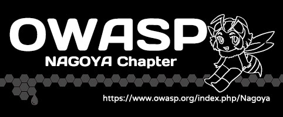
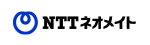

# OWASP Nagoya チャプターへようこそ 

OWASP Nagoyaはすべての方に参加できるメーリングリストに用意しております。 
メーリングリストの登録は
[こちら](https://groups.google.com/a/owasp.org/forum/?hl=ja#!forum/nagoya-chapter){:target="_blank"}からお願いします。 
 

OWASPの日本の各チャプターは以下のサイトで確認できます。 
* [OWASP Japan Area](https://owasp.org/chapters/#Asia){:target="_blank"}

ぜひとも、各チャプターのメーリングリストにご参加ください。

 

## **About OWASP / OWASPとは**

### [The Open Web Application Security Project]
*The Open Web Application Security Project*は、Webアプリケーションなどのソフトウェアのセキュリティと、セキュアなソフトウェア開発のための技術・プロセスについての情報提供/普及啓発を目的としたオープンコミュニティです。
各地域のチャプターは独立して活動しております。

**OWASP Nagoyaでは定期的にLocal Chapter Meeting / OWASP Nightと称した勉強会を開催しています。**  

### 皆様のご参加をお待ちしています。
 

## **Sponsorship/Membership**

* OWASPの活動はリーダーを含めすべて無報酬のボランティアにより成り立っています。これらは皆様のメンバーシップとドネーションによって賄われています。Chapter Meetingの会場をお貸しいただける方、スピーカーを務めて頂ける方、その他ご協力頂ける方はぜひ私たちまでご連絡ください。
   * スピーカーの方はSpeaker Agreement日本語訳をご一読下さい

* 個人、コーポレート、アカデミックメンバーとしてご登録をご希望の方はJoin Nowをクリックして下さい。
    * [Local Chapter Supporter](https://owasp.org/donate/?reponame=www-chapter-nagoya&title=OWASP+Nagoya){:target="_blank"}

* **2019年1月 株式会社エヌ・ティ・ティ ネオメイトが、ローカルチャプターサポーターとなりました。ありがとうございます**

    {:target="_blank"}

 
 

## **Recent Events** 
* 2021/02/17 OWASP Nagoya Chapter ミーティング 第20回
    * OWASP Sendai/Fukuoka/Okinawa とのリレー開催です。
        * 開催日： 4月14日（水）19:00-19:45

            | 時間 | イベント内容 |
            | --- | --- |
            | 18:30 | OWASP Sendai |
            | 19:00 | **OWASP Nagoya** |
            | 19:45 | OWASP Fukuoka |
            | 20:30 | OWASP Okinawa |
         

        * OWASP Nagoya
        
            1. クルマ業界におけるサイバーセキュリティの悩み(OWASP758クルマ分科会)
            2. 様々なTop10プロジェクトの紹介(loner49th )
            
        * 申し込みはConnpassから参加申込をお願いします。

 
 

## **Local News**

### 2021年
* 2021/02/17 OWASP Nagoya Cpahter ミーティング 第19回 / Online
    * OWASP Sendai/Fukuokaとのリレー開催です。
        * OWASP Nagoya Chapter（2月17日（水）21:00-）
            1. OWASP Nagoya Chapter活動紹介
            2. OWASP SecureFlag紹介

* 2021/01/15 OWASP Nagoya Chapter ミーティング 第18回 / オワスプナイト ナゴヤ(オンライン)
  

### 2020年
* 2020/01/27 OWASP Nagoya Chapter ミーティング 第15回 / オワスプナイト ナゴヤ
* 2020/03/06 OWASP Nagoya Chapter ミーティング 第16回
  * 新型コロナウィルスの状況が日々変化している状態であるため、第１６回のイベントは中止となりました。 

### 2019年
* 2019/01 株式会社エヌ・ティ・ティ ネオメイトが、ローカルチャプターサポーターとなりました。ありがとうございます！
* 2019/02/02 MINI Hardening & OWASP 名古屋
* 2019/02/08 OWASP Nagoya Chapter ミーティング 第9回
    * 公開資料：
        * [田中隆博さん「OWASP Top 10(2017) Serverlessでの解釈」](https://www.slideshare.net/TakahiroTanaka/owasp-top-10-serverless){:target="_blank"}
        * [西村将利さん「OWASP Top 10 2017 AWS WAF テンプレートについて」](https://www.slideshare.net/owaspnagoya/owasp-top10-2017-aws-waf-20190208){:target="_blank"}
        * [宮城正伸さん「脆弱性と共生するには」](https://www.slideshare.net/owaspnagoya/20190208vulnstudy){:target="_blank"}
* 2019/04/15 OWASP Nagoya Chapter ミーティング 第10回 / オワスプナイト ナゴヤ
* 2019/06/22 OWASP Nagoya Chapter ミーティング 第11回 / ハンズオン
* 2019/08/19 OWASP Nagoya Chapter ミーティング 第12回 / オワスプナイト ナゴヤ
* 2019/09/14 OWASP Nagoya Chapter ミーティング 第13回 / OWASP 758 Day
* 2019/11/15 OWASP Nagoya Chapter ミーティング 第14回
